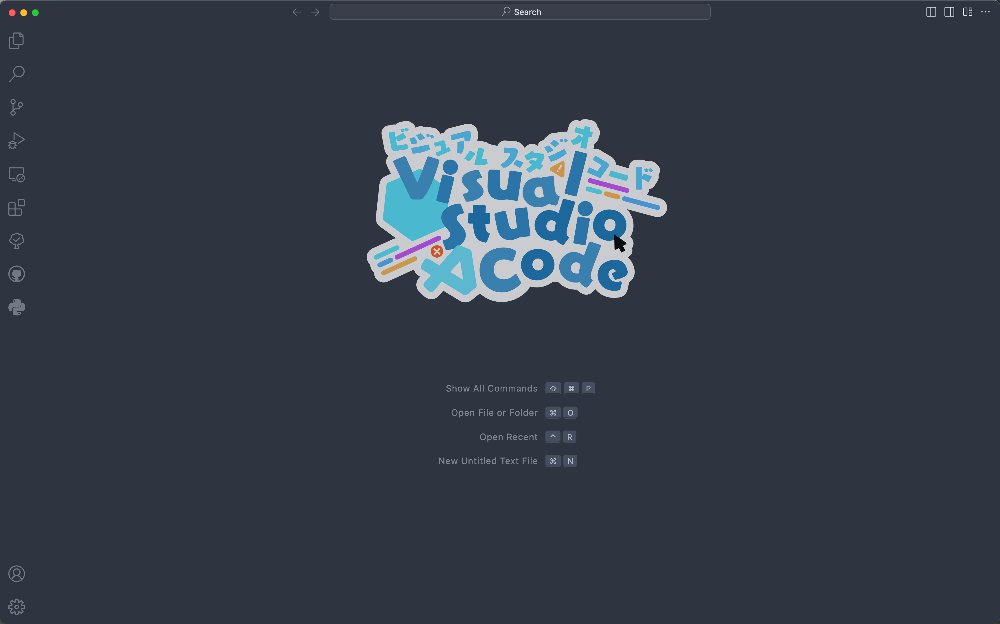

# Custom CSS and JS Loader 插件配置
## Vscode初始logo配置

按下`Ctrl+Shift+P`，输入`settings.json`，打开`settings.json`文件，添加如下配置：

```json
{
    "vscode_custom_css.imports": [
        "https://raw.githubusercontent.com/Jing-yilin/VscodeExtensionConfig/main/Custom%20CSS%20and%20JS%20Loader/cute_logo.css"
    ]
}
```

## 配置效果

